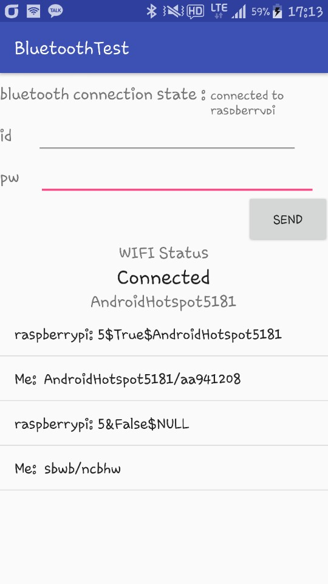
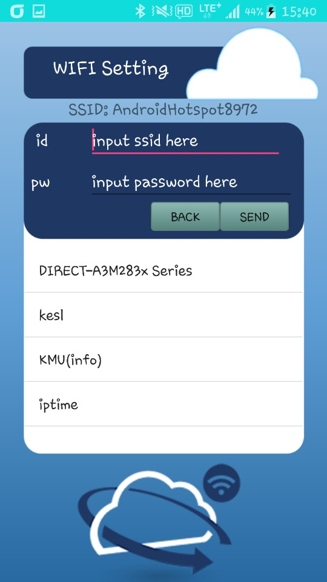

# 구름USB 안드로이드 어플

## 기능 1
와이파이 변경 및 상태 확인

### 실행흐름

0. 라파 <-> 폰 블루투스 페어링 서로 등록: 수동으로 했음, 후에 작업해야 함
1. 앱 실행
2. 라즈베리파이 블루투스 연결
3. SSID, PW 입력
4. 현재 라파가 네트워크에 연결되었는지 어느 와이파이에 연결되었는지 확인가능

## 기능 2(미구현)
계정 등록 및 변경

## 기능 3(미구현)
보안 레벨 설정

